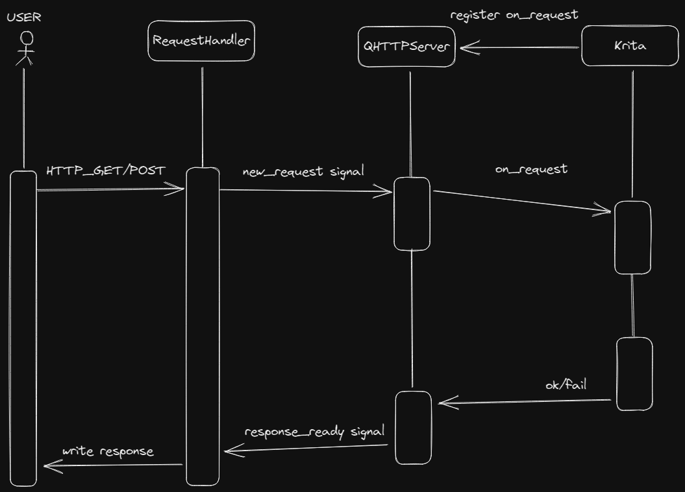

# Krita HTTP API

Expose Krita API by a HTTP Server and a websocket server)optional). The HTTP Server relies on python standard module `http.server`, a multi-threaded BIO HTTP server, which will read request body and respond a json. 

~~I'm going to replace it with a websocket server for better performance and let krita can push message.~~

# Usage

1. Download this repo as ZIP and Open Krita, import it via menu 'Tools/Scripts/Import Python Plugin from File' and make sure plugin 'HTTP API' is enabled.
2. (optional) if you need websocket server, cd to directory where `__init__.py` belongs to, run `pip install --target=./third_deps websockets`.
3. restart Krita, **open a document**
4. execute `curl -d '{"code": "floating-message", "param": {"message": "Hello, World!"} }' localhost:1976`

The HTTP server will listen port 1976, websocket server will listen port 1949. it's not configurable, modify source code if you need change it.

If you need add more API, just add more "controller"s in `./controllers`. both sync style and async style(like express.js) API is provided. there's a example for an API definition and implementation. 

```python
from ..json_validate import Nullable
from .route import route, router
from krita import *

@route('resource-icon', {
    'resourceType': str,
    'resourceName': str,
    'withMIMEType': Nullable(bool)
})
def resourceIcon(req):
    resource = Krita.instance().resources(req['resourceType'])[req['resourceName']]
    return qimage_to_png_base64(resource.image(), req.get('withMIMEType', True))
```

the request and response type would be (in typescript style):

```typescript
type RequestBody = {
    code: 'resource-icon',
    param: {
        resourceType: string,
        resourceName: string,
        withMIMEType?: boolean | null
    }
}

type Response<T> = {
    ok: true,
    data: T, // at this point, is string
} | {
    ok: false,
    msg: string,
    data: unknown,
    call_stack: string,
}

```

response status code will always be 200, use field 'ok' to check the request status.

# limitation

For the http server:

1. Sometimes it will timeout rather than throws exception when route code not found.
2. Server will reject further connections when there's already several (8 i guess) connections, it's responsible for the client to limit max connections.
3. The client must pull state in duration to sync states, it might be expensive. (but in my machine, i call 'state/get' in duration of 33ms and no performance problem found).

# Documentation

TODO you may check [V-YOP/krita-http-api-front](https://github.com/V-YOP/krita-http-api-front).

# Call Flow

If you'd like to imporve or modify this, check this sequence diagram explaining the handling process of an HTTP Request.


